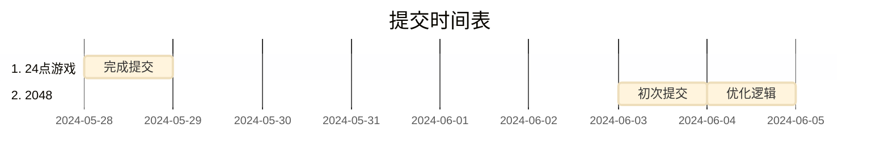

# everything
自己做的各种小玩具
 
 
 

## 时间甘特图

```mermaid
%%{init: {'theme': 'base', 'gantt': { 'displayMode': 'compact' }}}%%
gantt
    title 提交时间表
    dateFormat  YYYY-MM-DD
    axisFormat  %Y-%m-%d

    section 1. 24点游戏
    完成提交 :a1, 2024-05-28, 1d

    section 2. 2048
    初次提交 :b1, 2024-06-03, 1d
    优化逻辑 :b2, 2024-06-04, 1d
```